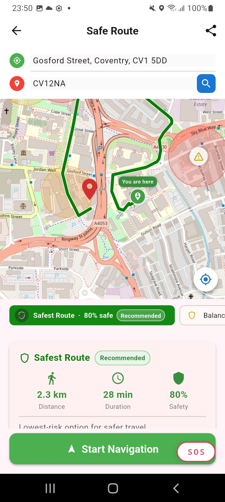
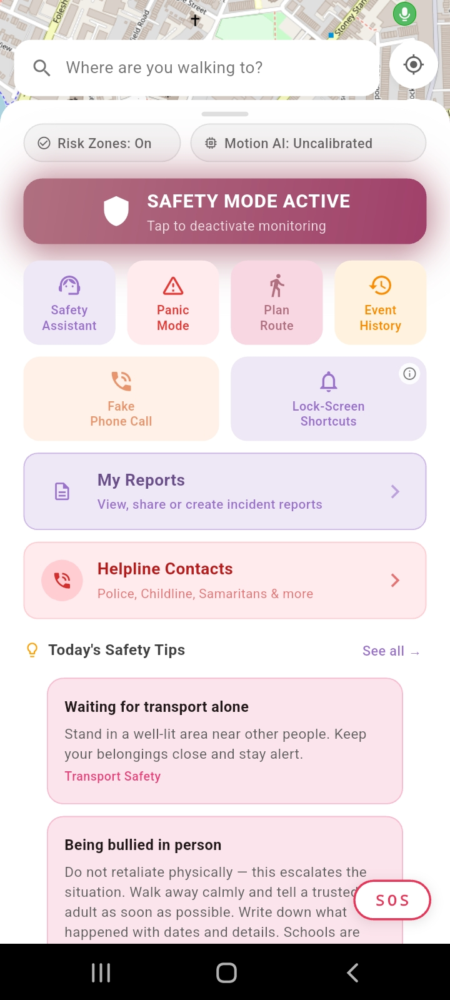
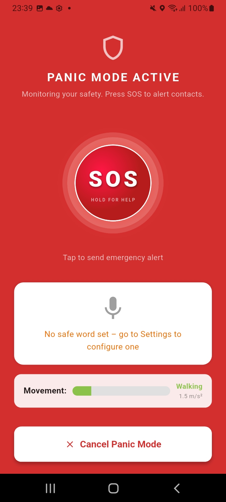
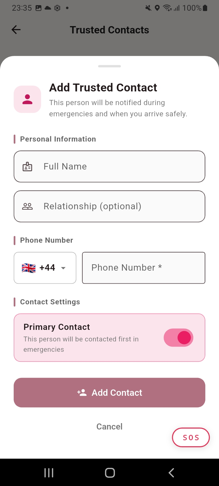
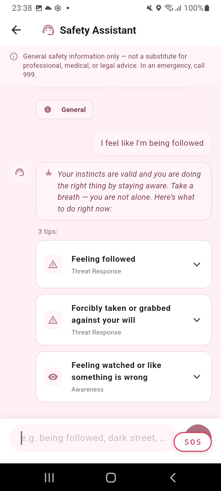
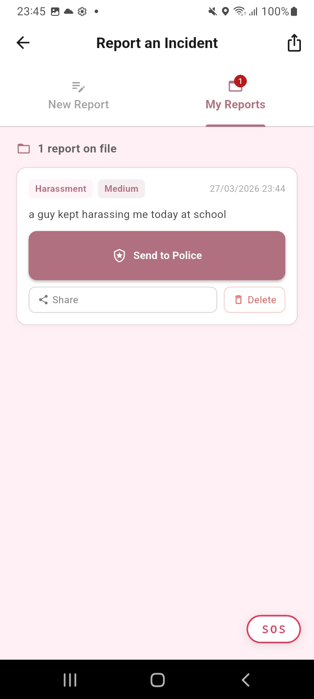
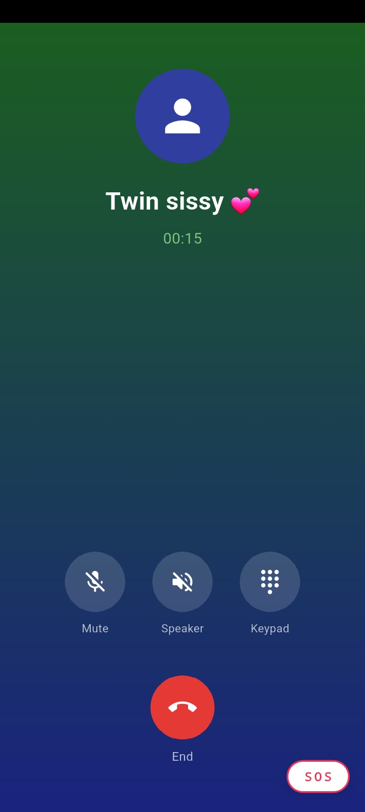
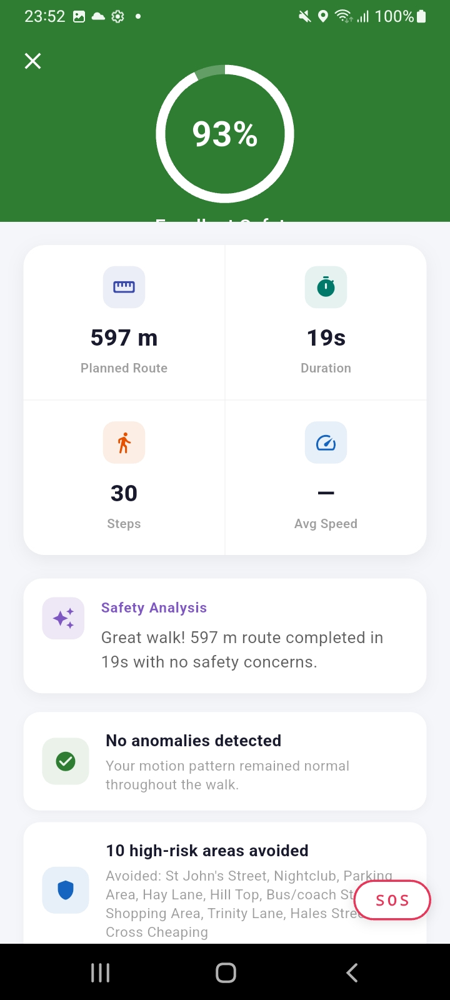

# SheSafe — Proactive Personal Safety App


SheSafe is my final-year Computer Science with Artificial Intelligence dissertation project at Coventry University.

It is a Flutter-based Android personal-safety application combining risk-aware route planning, personalised motion-anomaly monitoring, staged emergency escalation, safe-word recognition, trusted-contact alerts, incident reporting, fake-call support and post-walk summaries.

The core application follows a local-first design and does not require a proprietary cloud backend. Optional integrations provide live crime-data enrichment, backend-assisted analysis and additional route-generation functionality.

> **Research prototype:** SheSafe is not a replacement for emergency services, professional safety equipment or a certified medical fall-detection system.

## 🎥 Project Demo

[▶ Watch the SheSafe application demo](https://youtu.be/clXPXkwmGTI)

## 📱 Application Screenshots

| Safe Route                                                        | Safety Mode                                                            |
| ----------------------------------------------------------------- | ---------------------------------------------------------------------- |
|  |  |

| Panic Mode                                             | Trusted Contacts                                                        |
| ------------------------------------------------------ | ----------------------------------------------------------------------- |
|  |  |

| Safety Assistant                                                   | Incident Reporting                                                         |
| ------------------------------------------------------------------ | -------------------------------------------------------------------------- |
|  |  |

| Fake Call                                                                | Walk Summary                                                    |
| ------------------------------------------------------------------------ | --------------------------------------------------------------- |
|  |  |

## Project Highlights

* **Risk-aware route planning** with safer, balanced and direct route comparisons
* **Personalised motion monitoring** using device sensors and a calibrated walking baseline
* **Staged emergency escalation** through check-in, countdown and alert-dispatch states
* **Manual SOS access** across important application screens
* **Safe-word recognition** for discreet interaction with emergency workflows
* **Trusted-contact alerts** using Android SMS functionality
* **Safety Mode** for active walking-session monitoring
* **Post-walk summaries** containing session and safety information
* **Fake-call functionality** for uncomfortable or unsafe situations
* **Incident reporting** with local storage and sharing
* **Safety guidance** based on common personal-safety concerns
* **Offline resilience** through bundled and cached data
* **Local event logging** with sensitive-data redaction

## 1. Project Scope

### What SheSafe does

SheSafe is designed to support users during solo journeys and potentially unsafe situations.

The application can:

* Compare possible routes using relative safety and risk indicators
* Display safer, balanced and direct route options
* Monitor motion patterns during active walking sessions
* Compare motion windows against a personalised walking baseline
* Detect unusual movement patterns under controlled prototype conditions
* Present a check-in before escalating a possible emergency
* Allow the user to trigger Panic Mode manually
* Recognise a configured safe word
* Attempt to notify configured trusted contacts
* Support safe-arrival notifications
* Generate simulated incoming and active phone calls
* Store and share structured incident reports
* Provide safety guidance for common scenarios
* Create post-walk summaries and local event records
* Continue core workflows when optional services are unavailable

### What SheSafe does not do

* It does not directly dispatch police, ambulance or other emergency services
* It is not a certified medical or fall-detection device
* It cannot guarantee uninterrupted background operation on every Android device
* It does not guarantee that a suggested route is safe
* It should not be used as the only safety measure during a real emergency
* Its motion and route results represent prototype-level decision support

## 2. Core Features

| Feature               | Description                                                                       |
| --------------------- | --------------------------------------------------------------------------------- |
| Safe Route            | Compares safer, balanced and direct route options using relative risk information |
| Safety Mode           | Monitors an active walking session using location and motion information          |
| Panic Mode            | Uses check-in, countdown, alert-dispatch and cancellation stages                  |
| Motion Monitoring     | Compares sensor windows with the user's calibrated walking baseline               |
| Safe-Word Recognition | Recognises a configured phrase for discreet safety-workflow interaction           |
| Trusted Contacts      | Stores selected contacts and supports emergency or safe-arrival notifications     |
| Fake Call             | Simulates incoming and active phone-call screens                                  |
| Incident Reporting    | Creates structured reports that can be stored, shared or exported                 |
| Safety Assistant      | Presents relevant safety information based on a user's concern                    |
| Walk Summary          | Displays information after completion of an active walking session                |
| Event History         | Records safety-related application events locally                                 |
| Offline Operation     | Uses bundled or cached data when live services are unavailable                    |

## 3. Functional Behaviour

| Capability            | Trigger or Input                              | Processing                                                           | Result                                             | Fallback Behaviour                                          |
| --------------------- | --------------------------------------------- | -------------------------------------------------------------------- | -------------------------------------------------- | ----------------------------------------------------------- |
| Route intelligence    | Current location and destination              | Route scoring through `RiskEngineService` and `CrimeEvidenceService` | Relative safety information and route explanations | Uses cached or bundled synthetic data                       |
| Safety Mode           | Active walking session                        | Location and motion monitoring                                       | Session status, safety events and walk summary     | Continues with available local services                     |
| Motion monitoring     | Accelerometer stream                          | Motion-window scoring against a personalised baseline                | Anomaly score and possible escalation              | Uses conservative behaviour when calibration is unavailable |
| Panic escalation      | Manual SOS, motion anomaly or safe-word event | State-based processing through `PanicEscalationService`              | Check-in, countdown, dispatch attempt and logging  | User can cancel supported escalation stages                 |
| Trusted-contact alert | Emergency or safe-arrival workflow            | Android SMS functionality                                            | Alert attempt containing relevant information      | Failure is recorded in the local event log                  |
| Fake call             | User selects Fake Call                        | Simulated incoming and active call interfaces                        | Discreet exit-support feature                      | User can end or decline the simulated call                  |
| Safety Assistant      | User-entered concern                          | Guidance-category matching                                           | Relevant safety information and recommendations    | Displays general guidance if no exact match is found        |
| Incident reporting    | User-provided report details                  | Validation and local serialisation                                   | Stored and shareable incident report               | Incomplete required fields are blocked                      |
| Offline operation     | Internet or backend unavailable               | Cached and bundled data reuse                                        | Continued access to core workflows                 | Live enrichment resumes when connectivity returns           |

## 4. Non-Functional Design

| Quality Attribute    | Target                                                        | Implementation                                                  |
| -------------------- | ------------------------------------------------------------- | --------------------------------------------------------------- |
| Privacy              | Minimise unnecessary remote storage                           | Local-first storage and encrypted secure storage                |
| Resilience           | Avoid complete failure when optional services are unavailable | Cached data, bundled assets and fallback behaviour              |
| Auditability         | Preserve safety-related activity for review                   | Structured local event logging                                  |
| Accessibility        | Support clear and usable interaction                          | Material components, semantic labels and suitable touch targets |
| Offline availability | Keep essential workflows accessible                           | Bundled synthetic data and locally cached live data             |
| Maintainability      | Separate interface and business logic                         | Service-oriented Flutter architecture                           |
| Testability          | Validate safety-critical states and edge cases                | Automated unit, widget, workflow and resilience tests           |

## 5. Technology Stack

### Mobile application

* Flutter
* Dart
* Android platform integrations
* Material Design

### Backend and machine learning

* Python
* FastAPI
* Uvicorn
* NumPy
* Pandas
* scikit-learn
* Joblib
* Isolation Forest

### Data and external integrations

* OpenStreetMap
* Nominatim geocoding
* UK Police API
* Google Directions API — optional
* Android location services
* Android accelerometer and device sensors
* Android microphone and speech recognition
* Android SMS functionality
* Android battery and connectivity services

### Key Flutter packages

| Package                       | Responsibility                            |
| ----------------------------- | ----------------------------------------- |
| `flutter_map`, `latlong2`     | Map rendering and geographic calculations |
| `geolocator`, `geocoding`     | Location tracking and geocoding           |
| `sensors_plus`                | Motion and accelerometer information      |
| `speech_to_text`              | Safe-word recognition                     |
| `flutter_tts`, `audioplayers` | Fake-call speech and audio                |
| `battery_plus`                | Battery monitoring                        |
| `connectivity_plus`           | Connectivity-state monitoring             |
| `flutter_local_notifications` | Local notifications and quick actions     |
| `flutter_secure_storage`      | Protected local storage                   |
| `shared_preferences`          | Lightweight settings and cached state     |
| `permission_handler`          | Runtime permission management             |
| `http`                        | External API communication                |
| `provider`                    | Application and onboarding state          |
| `share_plus`, `path_provider` | Report export and sharing                 |
| `crypto`, `uuid`, `intl`      | Hashing, identifiers and formatting       |

## 6. System Requirements

* Flutter SDK compatible with the project configuration
* Dart SDK compatible with `pubspec.yaml`
* Android 8.0 or later — API level 26+
* Python 3.9 or later for the optional backend
* A physical Android device is recommended

A physical device provides more reliable access to:

* GPS
* Accelerometer data
* Microphone input
* Speech recognition
* SMS functionality
* Notifications
* Background-service behaviour

## 7. Quick Start

Clone the personal GitHub repository:

```bash
git clone https://github.com/Riyaazx/safety_app.git
cd safety_app
```

Install Flutter dependencies:

```bash
flutter pub get
```

Check available devices:

```bash
flutter devices
```

Run the application:

```bash
flutter run -d <device-id>
```

The optional FastAPI backend and Google Directions API key are not required for basic application testing.

### First-run check

After launching the application:

1. The application should open without a red crash screen
2. A new user should see the onboarding flow
3. Selecting **Get Started** should open the permission-explanation process
4. Completing onboarding should open the main application screen
5. Core screens should remain accessible without the optional backend

## 8. Data and API Configuration

### Are API keys required?

No API key is required for baseline operation.

* UK Police API access does not require an API key
* OpenStreetMap does not require a project-specific API key
* Nominatim geocoding does not require an API key
* Bundled synthetic datasets provide offline fallback behaviour

External services remain subject to their own availability and usage policies.

### Feature dependency matrix

| Feature                            |            Baseline Mode | Local FastAPI Backend | Google Directions Key |
| ---------------------------------- | -----------------------: | --------------------: | --------------------: |
| Application launch                 |                      Yes |                    No |                    No |
| Onboarding and local storage       |                      Yes |                    No |                    No |
| Bundled or cached risk map         |                      Yes |                    No |                    No |
| UK Police live enrichment          |                      Yes |                    No |                    No |
| Fallback route generation          |                      Yes |                    No |                    No |
| Backend route explanation          |                       No |                   Yes |                    No |
| Backend escalation acknowledgement |                       No |                   Yes |                    No |
| Backend safe-word verification     | Local fallback available |     Yes for full flow |                    No |
| Google-powered route alternatives  |                       No |                    No |                   Yes |

## 9. Optional FastAPI Backend

The optional backend is implemented in:

```text
app.py
```

It supports prototype-level:

* Route analysis
* Escalation acknowledgement
* Safe-word verification
* Motion-anomaly model integration

Required files:

```text
app.py
isolation_forest_model.pkl
scaler.pkl
requirements.txt
```

Install the Python dependencies:

```bash
pip install -r requirements.txt
```

Start the backend:

```bash
uvicorn app:app --host 0.0.0.0 --port 8000
```

Configure the backend address inside:

```text
lib/config/backend_config.dart
```

Suggested local values:

| Environment                       | Base URL                                    |
| --------------------------------- | ------------------------------------------- |
| Android emulator                  | `http://10.0.2.2:8000`                      |
| Physical device on the same Wi-Fi | `http://<your-lan-ip>:8000`                 |
| Windows hotspot                   | `http://192.168.137.1:8000` when applicable |

The Android device must be able to reach the computer running the backend.

## 10. Optional Google Directions Configuration

Google Directions is optional and provides additional route alternatives.

1. Create or select a project in Google Cloud Console
2. Enable the required routing service
3. Create an API key
4. Restrict the key to the required service
5. Apply appropriate application restrictions
6. Configure the key only in the local development environment

> **Security warning:** Never commit a real API key to this public repository. Use a restricted key locally and restore the placeholder before committing. A future improvement is to move key configuration into an ignored local file or environment-based setup.

Without a configured Google key, SheSafe continues using its fallback route workflow.

## 11. Architecture

The application uses a service-oriented Flutter structure. User-interface code is separated from core business logic to improve maintainability and testing.

```text
lib/
├── main.dart
├── app_navigator.dart
├── config/
├── features/
├── models/
└── services/
```

### Main directories

* `lib/main.dart` — application entry point and service initialisation
* `lib/app_navigator.dart` — global navigation and SOS-overlay support
* `lib/config/` — backend and application configuration
* `lib/features/` — onboarding, routes, Safety Mode, Panic Mode and reporting
* `lib/models/` — routes, users, contacts, events and safety-session models
* `lib/services/` — risk, escalation, storage, motion, safe-word, battery and notification logic
* `analysis/` — Python scripts used for model and motion-data evaluation
* `test/` — automated Flutter tests
* `integration_test/` — physical-device integration tests
* `assets/` — application resources, guidance and synthetic fallback data

### Risk-data loading order

SheSafe attempts to load risk information in this order:

1. Previously cached live risk zones
2. Bundled synthetic CSV data
3. Existing in-memory information if a refresh fails

This helps keep route-intelligence features available when live information cannot be refreshed.

## 12. Onboarding Flow

New users complete a structured setup process:

1. Welcome
2. Profile setup
3. Permission explanation
4. Permission request
5. Motion-baseline calibration
6. Safe-word configuration
7. Safe-word verification
8. Region selection
9. Trusted-contact setup
10. Review and completion

Completion status is stored locally so returning users can proceed directly to the main application.

## 13. Security and Privacy

### Local storage

* Sensitive profile information is stored using encrypted secure storage
* Lightweight settings and cache references use shared preferences
* Risk, crime and guidance fallback data are stored as bundled application assets
* Safety events are stored locally using capped event storage
* Export logic includes sensitive-field redaction

### Safe-word protection

The prototype uses secure-storage and hashing mechanisms to protect safe-word information.

A PBKDF2-HMAC-SHA256 representation is used within the profile-management workflow.

The current prototype contains separate mechanisms for active verification and stored-profile protection. Consolidating these into one verification design is documented as future technical work.

### Network and platform activity

Depending on the enabled features, SheSafe may communicate with:

* OpenStreetMap tile services
* Nominatim
* UK Police API
* The optional locally hosted FastAPI backend
* Google Directions when configured

SMS alerts are initiated through Android platform functionality.

Incident reports may use Android sharing or email workflows.

The core application does not require a proprietary SheSafe cloud backend.

### Repository protection

The `.gitignore` excludes:

* API keys and environment files
* Android signing keys
* Local configuration files
* Build output
* Flutter-generated files
* Python cache files
* Private research datasets
* Raw device logs
* Temporary test output
* IDE and operating-system files

Only fictional or anonymised names, phone numbers, safe words, locations and incident information should be used in public screenshots and demonstrations.

## 14. Testing and Evaluation

### Automated testing

**354 automated Flutter tests passed** across models, services, widgets, resilience and safety workflows.

Testing covered:

* Motion-anomaly scoring
* Personalised motion-baseline behaviour
* Panic-escalation state transitions
* Safe-word verification
* Route-risk scoring
* Route explanations and ordering
* Trusted-contact storage
* User-profile encryption
* Event logging
* Sensitive-data redaction
* Offline behaviour
* Backend failure handling
* Permission-denied scenarios
* Widget rendering and navigation
* Performance and latency thresholds

Detailed test implementations are available in the [`test`](test) directory.

### Motion evaluation

The dissertation evaluation included:

* **1,387 walking windows**
* **93.66% specificity** during controlled personalised motion-monitoring evaluation

These results represent bounded prototype testing and should not be interpreted as general real-world emergency-detection performance.

### Physical-device validation

Additional testing was conducted on a physical Android device for:

* GPS and route display
* Accelerometer monitoring
* Speech recognition
* Trusted-contact SMS workflows
* Safety Mode
* Panic Mode
* Fake-call functionality
* Post-walk summaries
* Offline fallback behaviour
* Notification workflows
* Cancellation controls

### Run the automated tests

```bash
flutter test
```

### Run the onboarding integration test

```bash
flutter test integration_test/onboarding_flow_test.dart -d <device-id>
```

A physical Android device is recommended.

> Test results represent controlled research-prototype evaluation. They are not certified medical, policing or emergency-system performance results.

## 15. Troubleshooting

| Problem                                 | Likely Cause                                       | Suggested Fix                                                                       |
| --------------------------------------- | -------------------------------------------------- | ----------------------------------------------------------------------------------- |
| Flutter cannot find the device          | USB debugging is disabled or unauthorised          | Enable USB debugging, accept the authorisation prompt and run `flutter devices`     |
| Backend features do not respond         | Backend is stopped or unreachable                  | Start Uvicorn and configure an IP address reachable from the device                 |
| Live crime information is unavailable   | External API or internet connection is unavailable | Continue using bundled or cached data                                               |
| Google route alternatives do not appear | API key is absent or invalid                       | Configure a restricted key locally or use fallback routing                          |
| Location features are blocked           | Location permission was denied                     | Re-enable location access in Android settings                                       |
| Safe-word backend verification fails    | Optional backend is unavailable                    | Use local fallback behaviour or restart the backend                                 |
| Sensor behaviour is unreliable          | Emulator or device-sensor limitation               | Use a supported physical Android device                                             |
| Background monitoring stops             | Manufacturer battery optimisation                  | Allow background operation and exclude the application from aggressive optimisation |

## 16. Reproducibility Checklist

1. Use Android API level 26 or later
2. Prefer a physical Android device
3. Enable required location, microphone, SMS and notification permissions
4. Run:

```bash
flutter clean
flutter pub get
```

5. Run the automated tests:

```bash
flutter test
```

6. Start the optional backend when testing backend-dependent features
7. Record the Flutter, Dart, Android and Python versions used
8. Use fictional test contacts and sample information
9. Do not upload real phone numbers, safe words, GPS logs or personal incident information

## 17. Known Limitations

* Live crime enrichment depends on external API availability and rate limits
* Bundled crime and risk CSV files contain synthetically generated prototype data
* The synthetic data does not represent verified historical crime records
* Motion evaluation used a limited personalised dataset under controlled conditions
* Motion results should not be generalised to all users, activities, devices or emergencies
* The in-app personalised baseline and optional Isolation Forest backend are separate prototype analysis paths
* Background GPS and service persistence vary across Android manufacturers
* Some devices do not include every expected motion sensor
* The application was validated primarily on Android
* The iOS project is scaffolded but has not been fully tested
* Live maps, geocoding and routing remain dependent on third-party services
* Safety guidance is general information and is not professional medical or legal advice

## 18. Future Improvements

* Move API-key configuration into an environment-based setup
* Expand motion evaluation across more users, devices and activities
* Improve Android background-service consistency
* Complete and validate the iOS implementation
* Add broader physical-device end-to-end testing
* Introduce regional safety-data providers outside the UK
* Consolidate safe-word storage and verification logic
* Expand accessibility and usability testing
* Improve automated route-quality evaluation
* Add a production-ready backend and secure authentication layer

## 19. Feedback

SheSafe includes an in-application feedback action.

It opens a pre-filled sharing or email workflow with relevant application and device context, allowing users or testers to report bugs and provide research feedback.

## 20. Licence

This repository contains a university research prototype.

See [`LICENSE`](LICENSE) for the complete licence terms.

The project is not intended for commercial use, certified emergency response or production deployment.
